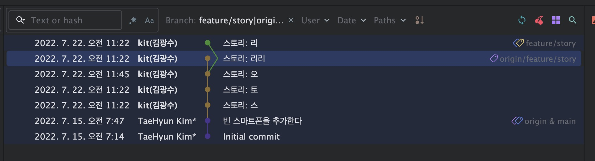
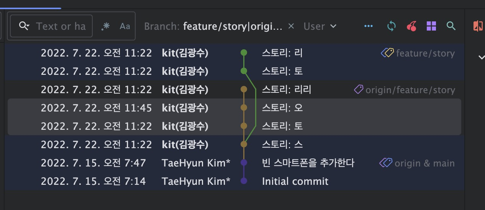
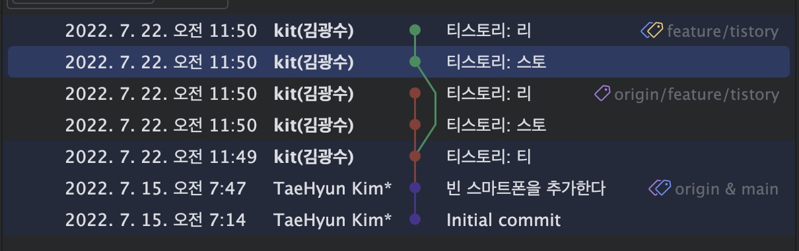
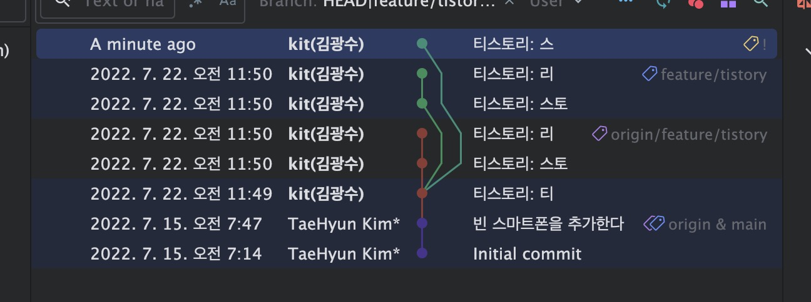
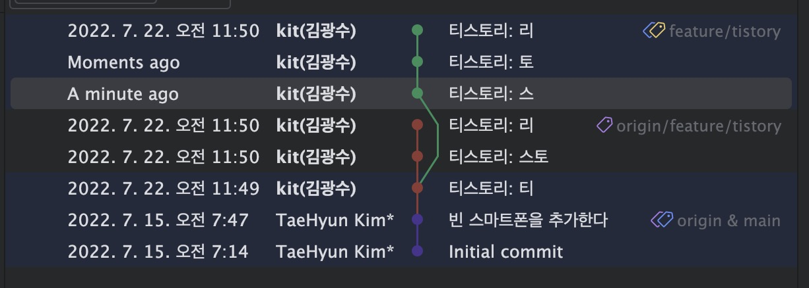
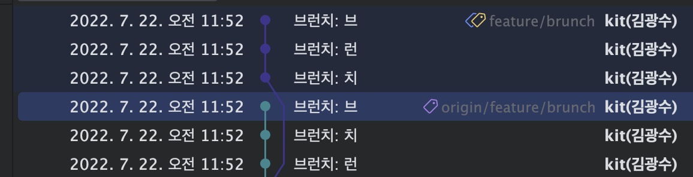
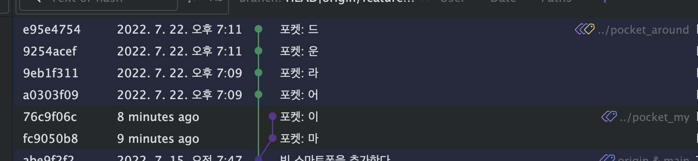
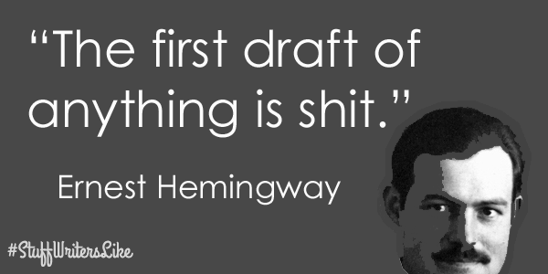

# 커밋 가지고 놀기

[git on lazygit 세미나](https://galcyurio-share.notion.site/galcyurio-share/Git-on-lazygit-fc1d992d7ebe438a846bb0e033897c83)에서 영감을 받아 제작하게 되었습니다.

## 워밍업

* 초기로 돌아가기 (reset)
* 여러 브랜치 같이보기

## 1. 커밋 메시지 변경하기

* feature/story 브랜치 체크아웃
* `스토리: 리리` 커밋에서 reword



```sh
git rebase -i ea015d281060ba530300b06af2e3113ec4c134d8^
```

## 2. 커밋 합치기

* feature/story 브랜치에서 계속
* `토` 커밋에서 rebase
* `오` 커밋을 fixup
* 다른방법: squash

> squash
>
> * 두 커밋을 합치고 두 커밋 메시지를 모두 보여주는 편집기가 열림
> * 합쳐진 커밋 메시지를 직접 편집 가능
    > *-* 두 커밋의 내용을 설명하는 새로운 메시지 작성 시 유용
>
> fixup
>
> * 두 커밋을 합치되 이전 커밋의 메시지만 유지
> * 편집기가 열리지 않고 자동으로 처리됨
> * 두 번째 커밋이 단순 수정/버그픽스일 때 유용

* 작업중엔 amend commit
* 사례
  



```sh
git rebase -i 744f66cb7591932f6814bc79d930e9b5a51d87f8^
```

## 3. 중간 커밋 소스 편집하기

* feature/tistory 브랜치 체크아웃
* `티스토리: 스토` 커밋에서 rebase, edit
* `티스토리: 스토` 커밋에서 스톨 -> 스토 로 변경
* 리베이스 계속
* intellij 한정, 소스를 먼저 고치고 fixup 하는 방법도 있음



```sh
git rebase -i c1107f247e90897286285992cfbd03894e3031eb^
# 파일변경
git add README.md
git commit --amend --no-edit
git rebase --continue
```

## 4. 커밋 나누기

* feature/tistory 브랜치에서 계속
* `티스토리: 티` 커밋에서 rebase, `티스토리: 스토` 커밋을 edit
* 이전 커밋으로 mixed reset
* `티스토리: 스` 스테이징, 커밋
  
* `티스토리: 토` 스테이징, 커밋
* 리베이스 계속
* 사례: 커밋이 너무 커졌을 때, 적당히 나누고 싶을때



```sh
git rebase -i 7df942d418918bd447a75cc1b7696bd3b80b4562^
git reset HEAD^
git add -p README.md
diff --git a/README.md b/README.md
index 475849d..134f0d6 100644
--- a/README.md
+++ b/README.md
@@ -11,7 +11,7 @@
   ..                                YJ.
   ..     스                         YJ.
    .                                J?.
-  ..                                J?.
+  ..     토                         J?.
   ..                                ?7.
    .                                ?7.
   ..                                77.
(1/1) Stage this hunk [y,n,q,a,d,e,p,P,?]?  y

# 스테이징 내용 나눠서 보기
git config --global alias.st-verbose '!git status && echo "\n=== Staged changes ===" && git diff --cached && echo "\n=== Unstaged changes ===" && git diff'
git st-verbose
interactive rebase in progress; onto c486b7c
...

Changes to be committed:
	modified:   README.md

Changes not staged for commit:
	modified:   README.md


=== Staged changes ===
diff --git a/README.md b/README.md
index b6e313c..475849d 100644
--- a/README.md
+++ b/README.md
@@ -9,7 +9,7 @@
   .^                                Y.
    .     티                         J.
   ..                                YJ.
-  ..                                YJ.
+  ..     스                         YJ.
    .                                J?.
   ..                                J?.
   ..                                ?7.

=== Unstaged changes ===
diff --git a/README.md b/README.md
index 475849d..134f0d6 100644
--- a/README.md
+++ b/README.md
@@ -11,7 +11,7 @@
   ..                                YJ.
   ..     스                         YJ.
    .                                J?.
-  ..                                J?.
+  ..     토                         J?.
   ..                                ?7.
    .                                ?7.
   ..                                77.

git commit -m "티스토리: 스"
git add -p README.md
git commit -m "티스토리: 토"
git rebase --continue
```

## 5. 커밋 순서 바꾸기

* feature/brunch 브랜치 체크아웃

<details>
<summary>직접해보기(쉬는시간)</summary>

* `브런치: 런` 커밋에서 리베이스
* `브런치: 브` 커밋을 제일 위로
* 나중에 테스트를 추가하고 TDD 라고 우길 수 있음.ㅋㅋ



```sh
git rebase -i cef9bf098b07346e71f0d7e3fe064e38602d160f^
git commit -a --no-edit
git rebase --continue
git add README.md
git rebase --continue

# 터미널에서 머지 도와주는 툴
# https://github.com/paulaltin/git-hires-merge
```
</details>

## 6. 커밋 복구하기

* feature/cafe 브랜치 체크아웃
* feature/cafe_table 브랜치 체크아웃
* rebase onto cafe, accept theirs 계속 ("테,이,블" 커밋을 날리는 상황)
* 커밋 사라짐
* git reflog
```sh
git reflog
# 리베이스 끝남
92ac514 (HEAD -> feature/cafe_table, origin/feature/cafe, feature/cafe) HEAD@{0}: rebase (finish): returning to refs/heads/feature/cafe_table
# 리베이스 시작
92ac514 (HEAD -> feature/cafe_table, origin/feature/cafe, feature/cafe) HEAD@{1}: rebase (start): checkout refs/heads/feature/cafe
# feature/cafe_table 체크아웃
20a1eb8 (origin/feature/cafe_table) HEAD@{2}: checkout: moving from feature/cafe to feature/cafe_table
```
* `20a1eb8` 아이디로 하드 리셋
```sh
git reset --hard 20a1eb8
git log --oneline --graph --decorate HEAD feature/cafe
```

<details>
<summary><strong>커밋을 복구했다면 이전 커밋은 사라졌을까?</strong></summary>

### 그렇치 않다

`.git/` 디렉토리는 작은 파일시스템 DB 이다.

.git 디렉토리의 내부구조

```
.git/
├── objects/     # 실제 데이터 (불변)
├── refs/        # 브랜치, 태그 (가변 포인터)
├── HEAD         # 현재 위치 포인터
├── logs/        # reflog (포인터 이동 기록)
└── index        # staging area
```

Git 에서 작업을 되돌릴 수 있는 이유는 커밋이 '사라지는 것' 이 아니라 '추가' 만 되며 '참조만 이동' 하기 때문이다. 즉, 과거 커밋은 물리적으로 그대로 남아있다. (단 오래된 객체는 주기적으로 정리한다)

</details>


## 번외: 좋은 PR이란?

> ## 좋은 PR이란?
>
> 좋은 PR은 잘 짜여진 데모와 같아야 합니다. 제목과 설명을 읽은 뒤 커밋을 하나씩 따라가다보면 작성자가 어디를 왜 변경했는지 명확하게 파악됩니다. 불필요하게 이렇게 변경했다 저렇게 변경했다 하지 않고, 필요한 배경 지식에 대한 참조가 제공되어 있어서 리뷰어의 시간을 낭비하지 않습니다.
>
> ### 커밋
>
> 의미 있는 단위로 나누어 커밋합니다. 하나의 커밋이 하나의 변경 의도만 갖게 합니다. 커밋 메시지에 변경 의도를 표현합니다.  
> 항상 완벽하게 의미 있는 단위로 나누어 커밋할 수는 없습니다. 처음에는 특히 더 그렇습니다. 하지만 이렇게 커밋하는 것은 좋은 개발 습관이며, 연습하면 나아질 수 있는 부분입니다.
> 다음과 같은 Git의 기능이 도움이 됩니다:
> * 한참 열심히 코드를 변경한 뒤 커밋하려고 보니 변경한 부분이 너무 많을 경우가 있습니다. 이럴 때는 라인 단위 스테이징 기능을 이용하십시오. 연관성이 많은 코드 조각들만 스테이징 한 뒤 커밋하기를 여러 차례 반복합니다.
> * 불필요하게 여러 차례 수정된 부분이 있다면 리베이스(rebase) 기능을 이용하여 커밋 순서를 변경하고 여러 커밋을 하나로 통합합니다.
> * 리베이스 기능으로 커밋 메시지도 보완할 수 있습니다.
>
> GitHub에 푸시하기 전에 위와 같은 방법으로 커밋 이력을 다듬어두면 PR을 리뷰할 때는 물론, 나중에 변경 이력을 추적할 때에도 도움이 됩니다.
>> 카페파트 PR 가이드 발췌

* 사례:
    * https://github.com/next-step/kotlin-lotto/pull/309/commits


## 번외: 중간에 머지커밋


> 5번 작업도 예를 들어보면, 동료와 같이 같은 기능을 개발하면 하나의 feature 브랜치에 커밋을 하게 됩니다. 서로 같은 커밋에서 시작했다가 feature 브랜치에 하나씩 merge 되기도 하고 얽히고설켜서 merge 되기도 합니다. 그러면 커밋 그래프가 복잡해지고 이력 확인을 할 때도 어렵게 됩니다. 그래서 커밋을 순차적으로 만들기 위해서 작업한 커밋이 feature의 최신 상태에서 시작하도록 rebase를 수행합니다.

> https://techblog.woowahan.com/2553/
> 

* 메인 브랜치의 최신버전을 반영하려 할 때
  
* merge 대신 rebase 를...

마무리: [개발자 글쓰기 코칭](https://youtu.be/xu3XGEomRWI?t=3329)
> # “The first draft of anything is shit”
> <details>
> <summary>누굴까요?</summary>
> 
> </details>
하수의 글쓰기: 글을 다 쓰고 나면
> * 이미 다 썼다고 생각한다
> * 맞춤법과 띄어쓰기 수정에 가장 집중한다
> * 쓰지마자 바로 검토한다
> * 공개하기 부끄러워서 혼자서만 보고 또 본다

<details>
<summary>개발로 바꾸면..</summary>
<ul>
<li>개발 끝났다고 생각한다</li>
<li>돌아가는데(동작하는데) 가장 집중한다</li>
<li>끝나자마자 PR 만들어서 리뷰 요청한다</li>
<li>코드를 공개하기 부끄러워서 바로 머지한다</li>
</ul>
</details>  

> 고치기의 명언: 이규보님의 시 쓰기
>
> "자기가 지은 것으로 보지 말고  
> 다른 사람이나 평생 심히 미워하는 자의 시를 보듯 하여.  
> 그 하자를 열심히 찾아도 찾지 못하면  
> 비로소 세상에 내놓을 수 있는 것이다."

번외 * lazygit
* https://github.com/jesseduffield/lazygit#installation
* 터미널 git 도구
* vi 좋아하는사람 추천 👍
* intellij 충돌 관리와 동일하게 하려면 https://github.com/paulaltin/git-subline-merge 설정 필요
